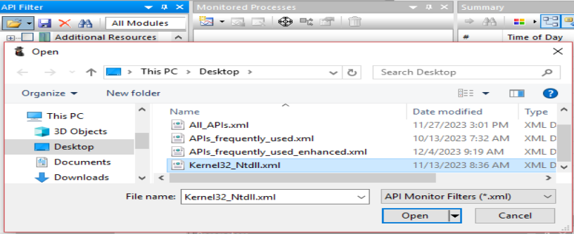
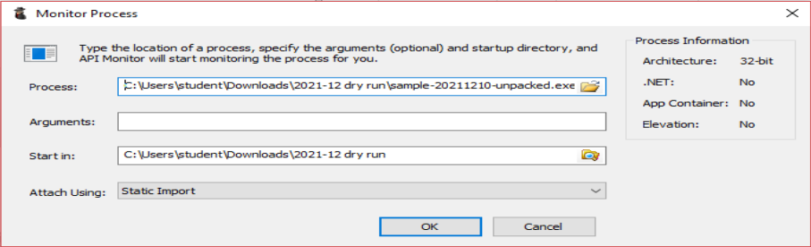
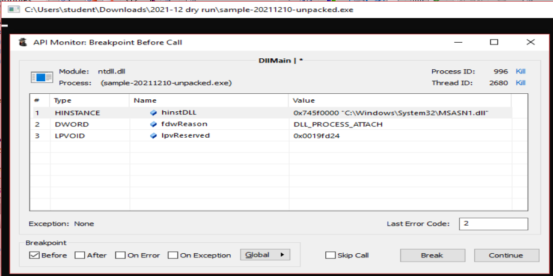
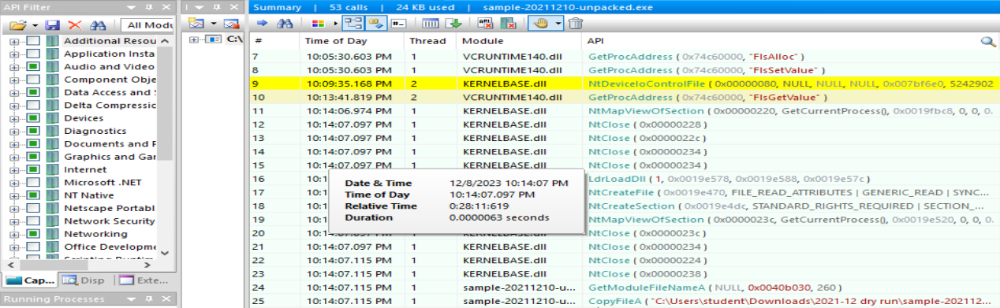
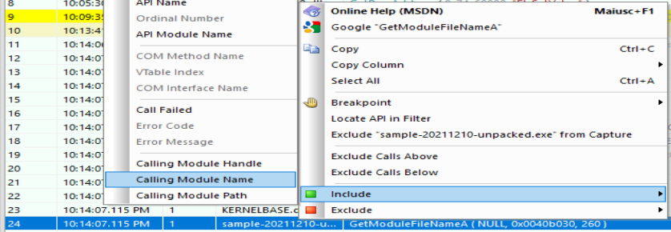
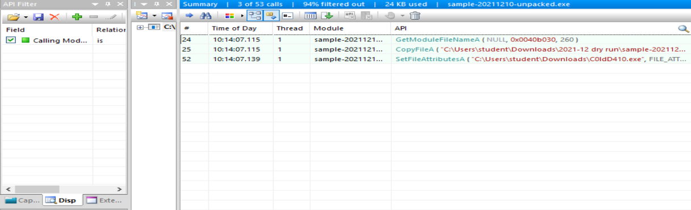
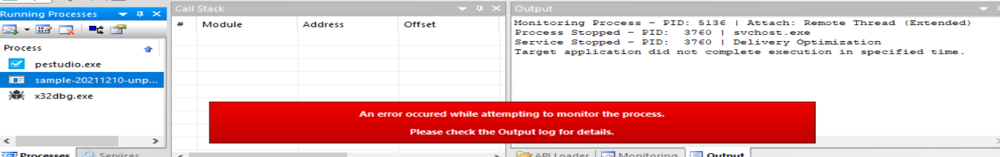

# Debugging with API Monitor
## Technique description
1. Run the chosen debugger with **administrative privileges**; for this tutorial I will use _x32dbg_.
2. Run `API Monitor` with **administrative privileges** and
   1. load a filter that blocks as soon as possible the sample to be analysed; I suggest to use the [Kernel32_Ntdll.xml](https://github.com/giadom/Debugging_with_API_Monitor/tree/main/Filters/) file present in the "Filters" directory of this repository;  
      
   2. start monitoring a new sample (i.e. a program **not currently running**).  
      
3. As you can see the program has stopped immediatly thanks to `API Monitor` (if you used the suggested filter, this interruption happened because every program calls immediatly an API of `Kernel32.dll` or `Ntdll.dll`); do not press the _Continue_ or _Break_ buttons for now. (In my case it stopped at _DllMain_, but it really depends on the sample under inspection).  
   
4. **Attach** the debugger chosen to the sample and **stay** on the debugger.
5. Put a **breakpoint** (a software one will be fine) to the entry point of the sample.  
   
6. Press the button to continue the execution (you will not move the Instruction Pointer because `API Monitor` is blocking it).
7. Go again to `API Monitor` and **clear** the API filter (i.e. press the red _X_ on the _API Filter_ tab).
8. Load a filter that filters/inspects the **desired APIs**; I suggest to load [APIs-frequently_used_enhanced.xml](https://github.com/giadom/Debugging_with_API_Monitor/tree/main/Filters/) present in the "Filters" directory of this repository.
9. Go to the window borned in point 2.ii. (i.e. right after having started to monitor the sample) and press _Continue_.
10. Now go to the debugger and, as you can see, the Instruction Pointer stopped exactly at the breakpoint placed in the entry point.  
   
11. Now, while debugging with the debugger, `API Monitor` will **track** the APIs selected in the filter loaded in point 8..  
    **Tip**: As you can see, APIs commonly abused by malwares are also called by legit DLLs used by the sample itself:  
      
    For this reason I strongly suggest to put a _display filter_: looking at the _Module_ column of the _Summary_ tab, just go to the module having the same name of the sample (in my case _sample-20211210-unpacked.exe_) and then:
    1. right click on it;
    2. go to `Include`;
    3. press the `Calling Module Name` button.  
      
    As you can see now you can better understand what is happening:  
    
12. When done with the analysis of the sample, terminate it from the debugger or from `API Monitor`.

## Other notable use cases
### Analyse some anti-static-analysis techniques
### Get the malicious payload injected in a victim process/thread
### Easily interact with the parameters of an API
As you have seen in the previous use case, you can easily interact with the parameters passed to an API: this include changing their values which at the end allows you to easily change the behaviour of a sample and hence better understand all its possible paths.

# FAQs
## Why do not simply attach API Monitor to a program under debugging?
Unfortunately API Monitor will fail in doing such operation: it will print an error message.  
[^1]
[^1]: The screenshot is for the _Remote Thread (Extended)_ mode of attaching, but also the others fail.

## What about anti-debugging techniques used by samples?
This technique (as it is) can be detected by a sample looking for manually inspection traces.

# To do list
- [ ] Complete the guide. (By the way... you are ready to analyse samples yet).
- [ ] Explain why this technique works.
